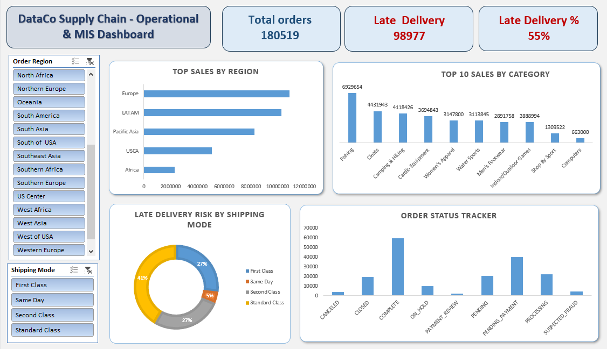

# Smart Supply Chain Operational & MIS Dashboard 🚚📊

## 📌 Project Overview
This project focuses on analyzing a comprehensive Supply Chain dataset to uncover actionable business insights, optimize delivery processes, and evaluate sales performance across different global markets. I transformed massive volumes of raw data into a clean, structured format and developed a fully interactive, automated MIS dashboard entirely in **Advanced Microsoft Excel** to track key performance indicators (KPIs).# Smart Supply Chain Operational & MIS Dashboard 🚚📊

## 📌 Project Overview
This project focuses on analyzing a comprehensive Supply Chain dataset to uncover actionable business insights, optimize delivery processes, and evaluate sales performance across different global markets. I transformed massive volumes of raw data into a clean, structured format and developed a fully interactive, automated MIS dashboard entirely in **Advanced Microsoft Excel** to track key performance indicators (KPIs).

This project demonstrates end-to-end data reporting workflows—from raw data wrangling to dynamic visualization—skills critical for driving operational efficiency.

## 📂 Dataset Access
Due to the large file sizes, the raw and cleaned datasets are securely hosted on Google Drive.
- **Data Repository:** [Click here to access the Raw and Clean Data folders](https://drive.google.com/drive/folders/1stqUehR-VC9BXWs6CiaBTua3fKF9Km8z?usp=sharing)
- **Features:** 53 columns including Delivery Status, Category Name, Customer Segment, Order Profit Ratio, Sales, Shipping Mode, Market, etc.
- **Total Records Analyzed:** 180,519 Orders
- **Domain:** Supply Chain Management, Logistics, and E-commerce.

## 🛠️ Tools & Technologies Used
- **Data Cleaning & Wrangling:** Microsoft Excel (Power Query, Data Validation, handling missing values)
- **Advanced Formulas:** SUMIFS, COUNTIFS, VLOOKUP, INDEX-MATCH for deep data extraction.
- **MIS & Dashboarding:** Advanced Excel (Dynamic Pivot Tables, Pivot Charts, Interactive Drill-through Slicers, KPI Cards)
- **Version Control:** Git & GitHub

## 🚀 Key Objectives & Business Insights
1. **Delivery Risk & Logistics Bottlenecks:** 
   - Discovered a critical operational flaw: **55% of total orders (98,977 out of 180,519)** faced late deliveries.
   - Identified that **Standard Class (41%)** and **First/Second Class (27% each)** were the primary contributors to delays, signaling a need to optimize SLA terms.
2. **Market & Regional Performance:** 
   - Revealed that **Europe and LATAM** are the powerhouse regions driving the highest sales volume, far outpacing the USCA and Africa markets.
3. **Top Revenue-Driving Categories:** 
   - Analyzed product-level performance. Outdoor and sports categories like **Fishing (~$6.9M in sales)**, **Cleats**, and **Camping & Hiking** dominated the revenue stream.
4. **Order Status Tracking:** 
   - Monitored the daily order pipeline to track 'Complete', 'Pending Payment', and 'Processing' statuses, highlighting areas to improve fulfillment and cash flow.

## 📊 Dashboard Preview
The dashboard provides a high-level view of critical Supply Chain KPIs. Below is a snapshot of the finalized visual analysis:



## ⚙️ How to Use This Repository
1. Clone this repository to your local machine:
   ```bash
   git clone [https://github.com/Anuj-Kumar-Tiwari/your-repo-name.git](https://github.com/Anuj-Kumar-Tiwari/your-repo-name.git)

This project demonstrates end-to-end data reporting workflows—from raw data wrangling to dynamic visualization—skills critical for driving operational efficiency.

## 📂 Dataset Access
Due to the large file sizes, the raw and cleaned datasets are securely hosted on Google Drive.
- **Data Repository:** [Click here to access the Raw and Clean Data folders](https://drive.google.com/drive/folders/1stqUehR-VC9BXWs6CiaBTua3fKF9Km8z?usp=sharing)
- **Features:** 53 columns including Delivery Status, Category Name, Customer Segment, Order Profit Ratio, Sales, Shipping Mode, Market, etc.
- **Total Records Analyzed:** 180,519 Orders
- **Domain:** Supply Chain Management, Logistics, and E-commerce.

## 🛠️ Tools & Technologies Used
- **Data Cleaning & Wrangling:** Microsoft Excel (Power Query, Data Validation, handling missing values)
- **Advanced Formulas:** SUMIFS, COUNTIFS, VLOOKUP, INDEX-MATCH for deep data extraction.
- **MIS & Dashboarding:** Advanced Excel (Dynamic Pivot Tables, Pivot Charts, Interactive Drill-through Slicers, KPI Cards)
- **Version Control:** Git & GitHub

## 🚀 Key Objectives & Business Insights
1. **Delivery Risk & Logistics Bottlenecks:** 
   - Discovered a critical operational flaw: **55% of total orders (98,977 out of 180,519)** faced late deliveries.
   - Identified that **Standard Class (41%)** and **First/Second Class (27% each)** were the primary contributors to delays, signaling a need to optimize SLA terms.
2. **Market & Regional Performance:** 
   - Revealed that **Europe and LATAM** are the powerhouse regions driving the highest sales volume, far outpacing the USCA and Africa markets.
3. **Top Revenue-Driving Categories:** 
   - Analyzed product-level performance. Outdoor and sports categories like **Fishing (~$6.9M in sales)**, **Cleats**, and **Camping & Hiking** dominated the revenue stream.
4. **Order Status Tracking:** 
   - Monitored the daily order pipeline to track 'Complete', 'Pending Payment', and 'Processing' statuses, highlighting areas to improve fulfillment and cash flow.

## 📊 Dashboard Preview
The dashboard provides a high-level view of critical Supply Chain KPIs. Below is a snapshot of the finalized visual analysis:


## ⚙️ How to Use This Repository
1. Clone this repository to your local machine:
   ```bash
   git clone [https://github.com/Anuj-Kumar-Tiwari/your-repo-name.git](https://github.com/Anuj-Kumar-Tiwari/your-repo-name.git)
